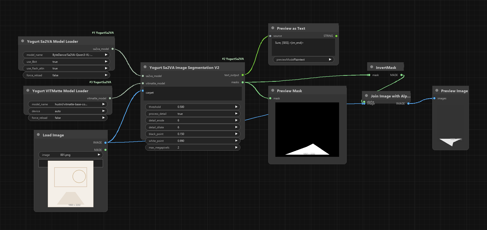

# ComfyUI-YogurtSa2VA

YogurtSa2VA 是一个 ComfyUI Sa2VA 分割插件，基于
[alexjx/ComfyUI-Sa2VA-XJ](https://github.com/alexjx/ComfyUI-Sa2VA-XJ)
改造而来。

原项目提供 Sa2VA 图片分割、视频分割和 VITMatte 精修节点。这个版本保留
Sa2VA-XJ 的核心推理流程，并把模型加载拆成独立节点，让同一个已加载模型可以
被多个下游节点复用，同时接入 ComfyUI 的显存管理队列。

## 和 Sa2VA-XJ 的主要区别

| 项目 | Sa2VA-XJ | YogurtSa2VA |
| --- | --- | --- |
| Sa2VA 加载 | 分割节点内部加载 | 独立 `Yogurt Sa2VA Model Loader` |
| VITMatte 加载 | V2 节点内部加载 | 独立 `Yogurt VITMatte Model Loader` |
| 模型复用 | 多个节点容易重复加载 | Loader 输出模型对象，可接多个节点 |
| 缓存策略 | 节点级加载/释放 | 按模型名和加载参数缓存 |
| ComfyUI 显存管理 | 手动 unload 为主 | 注册到 `comfy.model_management`；fp16/bf16 可换入/换出，8-bit 可释放并按需重载 |

## 节点

| 节点 | 输出 | 用途 |
| --- | --- | --- |
| `Yogurt Sa2VA Model Loader` | `YOGURT_SA2VA_MODEL` | 加载并缓存 Sa2VA 主模型 |
| `Yogurt VITMatte Model Loader` | `YOGURT_VITMATTE_MODEL` | 加载并缓存 VITMatte 精修模型 |
| `Yogurt Sa2VA Image Segmentation` | `STRING`, `MASK` | 单图分割 |
| `Yogurt Sa2VA Video Segmentation` | `STRING`, `MASK` | 图片批次或视频帧分割 |
| `Yogurt Sa2VA Image Segmentation V2` | `STRING`, `MASK` | 单图分割 + VITMatte 边缘精修 |

典型连接方式：

```text
Yogurt Sa2VA Model Loader
  -> Yogurt Sa2VA Image Segmentation
  -> Yogurt Sa2VA Video Segmentation

Yogurt Sa2VA Model Loader
Yogurt VITMatte Model Loader
  -> Yogurt Sa2VA Image Segmentation V2
```

## 示例工作流



示例工作流文件：

- [examples/sa2va-example.json](examples/sa2va-example.json)

导入方式：把 `examples/sa2va-example.json` 拖进 ComfyUI 画布，或在 ComfyUI
菜单中选择导入 workflow。

该示例展示的是 V2 精修链路：

```text
Load Image
Yogurt Sa2VA Model Loader
Yogurt VITMatte Model Loader
  -> Yogurt Sa2VA Image Segmentation V2
  -> Preview as Text
  -> Preview Mask
  -> InvertMask
  -> Join Image with Alpha
  -> Preview Image
```

示例默认参数：

- Sa2VA：`ByteDance/Sa2VA-Qwen3-VL-4B`
- VITMatte：`hustvl/vitmatte-base-composition-1k`
- Prompt：`carpet`
- `threshold`：`0.5`
- `process_detail`：`true`

如果导入后图片节点提示缺少 `001.png`，直接在 `Load Image` 节点重新选择你的图片即可。

## 安装

把插件目录放到 ComfyUI 的 `custom_nodes` 下：

```powershell
cd ComfyUI\custom_nodes
git clone <your-repo-url> ComfyUI-YogurtSa2VA
cd ComfyUI-YogurtSa2VA
python -m pip install -r requirements.txt
```

VITMatte 和形态学处理依赖 OpenCV；如果环境里没有，请安装：

```powershell
python -m pip install opencv-python
```

可选依赖：

```powershell
python -m pip install bitsandbytes
python -m pip install flash-attn --no-build-isolation
```

安装后重启 ComfyUI。

## 模型目录

插件会注册两个 ComfyUI 模型目录：

```text
ComfyUI/models/sa2va
ComfyUI/models/vitmatte
```

推荐把 Hugging Face 模型完整下载到这些目录，目录内必须包含
`config.json`。示例：

```text
ComfyUI/models/sa2va/ByteDance/Sa2VA-Qwen3-VL-4B/config.json
ComfyUI/models/vitmatte/hustvl/vitmatte-small-composition-1k/config.json
```

也支持不带组织名前缀的目录：

```text
ComfyUI/models/sa2va/Sa2VA-Qwen3-VL-4B/config.json
ComfyUI/models/vitmatte/vitmatte-small-composition-1k/config.json
```

下拉列表会扫描 `models/sa2va` 和 `models/vitmatte` 下所有包含
`config.json` 的子目录，并把相对路径显示为模型名。复制新模型后，如果下拉
列表没有刷新，请重启 ComfyUI 或刷新前端节点定义。

## 默认模型名

Sa2VA Loader 默认包含以下候选：

```text
kumuji/Sa2VA-i-1B
ByteDance/Sa2VA-Qwen3-VL-4B
ByteDance/Sa2VA-InternVL3-2B
ByteDance/Sa2VA-Qwen2_5-VL-3B
ByteDance/Sa2VA-Qwen2_5-VL-7B
ByteDance/Sa2VA-InternVL3-8B
ByteDance/Sa2VA-InternVL3-14B
```

VITMatte Loader 默认包含：

```text
hustvl/vitmatte-base-composition-1k
hustvl/vitmatte-small-composition-1k
```

如果本地没有找到对应目录，Transformers 会按模型名尝试从 Hugging Face 下载。

## 显存管理

两个 Loader 加载模型后，会把底层 torch module 包装成
`YogurtComfyManagedModel` 并注册到 ComfyUI 的 `model_management`。

当前实现的行为：

- Loader 节点只加载一次，同一组参数会复用缓存。
- 下游分割节点执行前会调用 ComfyUI 的 `load_models_gpu`，确保模型被换回推理设备。
- 当其它节点需要显存时，ComfyUI 可以通过 `free_memory` 触发 offload。
- fp16/bf16 模型的 offload 粒度是整模型 CPU/GPU 搬运，不是 ComfyUI 原生 UNet 那种分块加载。
- `bitsandbytes` 8-bit 模型无法可靠执行 `.to("cpu")`，因此释放显存时会删除模型对象并保留 Loader 配置；下一次下游节点执行前会自动重载。
- 8-bit 删除会延迟到 ComfyUI 当前 `free_memory` 调用完成后再释放真实 torch model 引用，避免触发 ComfyUI 的 weakref 清理逻辑导致卸载节点报错。

这个设计的取舍是：8-bit 可以被 ComfyUI 释放显存，但下一次使用会有重新加载模型的耗时。

## Loader 参数

### Yogurt Sa2VA Model Loader

| 参数 | 说明 |
| --- | --- |
| `model_name` | Sa2VA 模型名或本地相对路径 |
| `use_8bit` | 使用 8-bit 量化，需安装 `bitsandbytes` |
| `use_flash_attn` | 尝试启用 flash attention，需安装 `flash-attn` |
| `force_reload` | 丢弃缓存并重新加载该模型 |

### Yogurt VITMatte Model Loader

| 参数 | 说明 |
| --- | --- |
| `model_name` | VITMatte 模型名或本地相对路径 |
| `device` | `auto`、`cuda` 或 `cpu` |
| `force_reload` | 丢弃缓存并重新加载该模型 |

## 分割参数

`Yogurt Sa2VA Image Segmentation` 和
`Yogurt Sa2VA Video Segmentation` 支持：

- `segmentation_prompt`：要分割的对象描述。
- `threshold`：mask 二值化阈值。
- `morph`：`none`、`opening`、`closing`、`erode`、`dilate`。
- `erode_kernel`、`dilate_kernel`、`iterations`：形态学处理参数。

`Yogurt Sa2VA Image Segmentation V2` 额外支持：

- `process_detail`：是否启用 VITMatte 精修。
- `detail_erode`、`detail_dilate`：trimap 生成参数。
- `black_point`、`white_point`：alpha 结果拉伸参数。
- `max_megapixels`：VITMatte 处理分辨率上限。

## 常见问题

### 模型复制进目录后，下拉列表刷不出来

确认以下几点：

1. 模型目录在 `ComfyUI/models/sa2va` 或 `ComfyUI/models/vitmatte` 下。
2. 目标目录内直接或间接存在 `config.json`。
3. 不是 Hugging Face cache 的 `models--org--name/snapshots/...` 结构直接丢进去；
   推荐用 `huggingface-cli download --local-dir` 下载成普通目录。
4. 复制模型后重启 ComfyUI，或刷新前端节点定义。

### 8-bit 加载失败

安装 `bitsandbytes`，或者关闭 `use_8bit`。8-bit 模型释放显存时采用删除并按需
重载策略；如果你更重视后续节点切换速度，可以关闭 `use_8bit` 使用 fp16/bf16 的
CPU/GPU 搬运路径。

### VITMatte 节点不可用

确认已安装 `opencv-python`，并且 VITMatte 模型目录下有 `config.json`。

### threshold 对某些模型不明显

当前可配置 threshold 的 raw-mask patch 主要覆盖 Qwen 系列 Sa2VA 模型。其它模型
可能使用模型默认二值化行为。

## 来源与致谢

本项目基于
[alexjx/ComfyUI-Sa2VA-XJ](https://github.com/alexjx/ComfyUI-Sa2VA-XJ)
改造。感谢原项目对 ByteDance Sa2VA ComfyUI 节点、VITMatte 后处理、模型路径和
本地优先加载逻辑的实现。

本项目不是 ByteDance、alexjx 或 ComfyUI 官方项目。分发或二次修改时，请同时
遵循上游项目和相关模型的许可证与使用条款。
